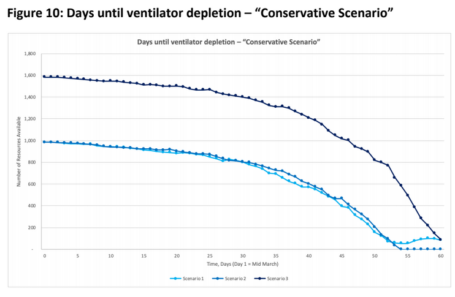
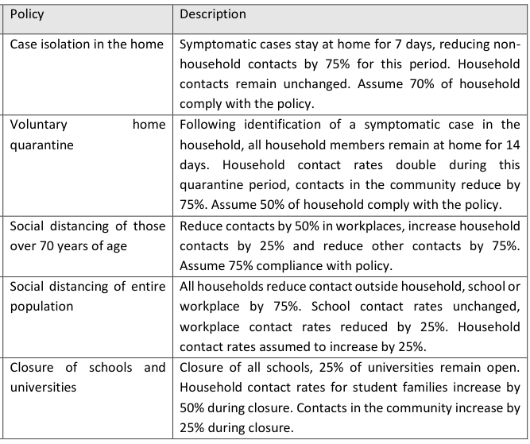
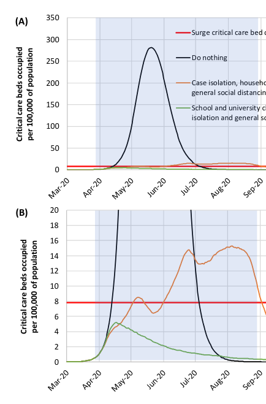

---
title: COVID-19's impact on Ontario
author: Jeff Wintersinger
date: March 19, 2020
...

There are two good reports relevant to COVID-19's impact on Ontario.

1. [Report from Imperial College of London (ICL)](https://www.imperial.ac.uk/media/imperial-college/medicine/sph/ide/gida-fellowships/Imperial-College-COVID19-NPI-modelling-16-03-2020.pdf). This came out on Monday (Mar. 16th). It's a sophisticated, robust analysis that's specific to Great Britain and the US, but the general conclusions hold equally well for Canada & Ontario.

2. [Report from a bunch of UofT/UHN/Sunnybrook people](https://www.covid-19-mc.ca/). This came out last night (Mar. 18th). It's not sophisticated as the ICL report, but it's specific to Ontario.

Both reports take a similar approach---they model the behaviour of individual patients, seeing how the number of infections changes over time and how it compares to health care system capacity.
The ICL approach is more sophisticated because they model how different kinds of interventions (social distancing, etc.) change things through time.

Ontario report
--------------

I'll start with the Ontario report.
Based on how COVID-19 has impacted other countries to date, they assume that 19% of infected people have severe cases requiring hospitalization; one-quarter of those go into the ICU because they're especially bad; and half of those ICU cases need ventilators.
Ventilator capacity is the limiting factor everywhere---this study assumes 1300 ventilators in Ontario, but depending on who you ask, it may be up to 2000.
Of course, many of those are already in use for existing patients.

The Ontario report plays with two main scenarios.
"Italy" is where the number of cases increases 33% each day, similar to what we've seen in Italy and elsewhere in the West before mitigation measures were enacted; "conservative" is where the number of cases increased by 7.5% each day.
Both are forms of exponential growth, which is super bad news---think of it like compound interest.
(Einstein supposedly said that "compound interest is the most powerful force in the universe.") Unlike the ICL report, which explicitly models the effect of different interventions such as closing schools and social distancing, the Ontario report assumes those measures are reflected in the "conservative" 7.5% daily case increase being lower than the "Italy" 33% daily increase.

This is the critical figure.
Under the "Italy" growth rate, we hit ventilator capacity in 35 to 42 days (fig. 1).
The figure shows separate curves for scenarios 1 to 3, which reflect the effect of adding a few hundred additional emergency ventilators from ambulances/stockpiles/whatever.
These additional ventilators don't substantially affect the outcome.

However, even the "conservative" scenario is super bad.
This is where we reduce the daily increase in cases to 7.5%, meant to reflect the effect that social distancing is having (fig. 2).
We still run out of ventilators in ~2 months.
Ultimately, if Ontario gets anything approaching the expected growth in cases, we're screwed.
This is true for every health system in the world, because it's the consequence of exponential growth.
While people are looking at means of rapidly building new ventilators, or hooking multiple patients up to single ventilators, even if we could massively increase our ventilator capacity, there are other limiting factors such as ICU beds, number of nurses and doctors, and so forth.

Imperial College of London report
---------------------------------

The ICL report considers five possible interventions, such as isolating affected people or closing schools and universities (fig. 3).
The report starts by considering "mitigation" strategies.
These are in contrast to "suppression." "Mitigation" tries to make the outbreak less severe while avoiding the most invasive social measures, such as months-long social distancing by everyone.
Under "mitigation," the average infected person still infects more than one other person.
Thus, the disease continues to spread until the majority of people have been infected and developed immunity ("herd immunity"), or until a vaccine is developed and we can stop all this madness.
However, the time horizon for a vaccine is 12-18 months.
Life won't return to normal under a vaccine is developed, produced, and deployed en masse, but this likely won't happen soon.

"Suppression," by contrast, takes more invasive measures to reduce the number of infections seeded by each infected person to less than one.
The conclusion of the report is, ultimately, that suppression will be necessary---mitigation is nowhere close to enough to avoid overwhelming the health system.

This figure shows just how insufficient "mitigation" is (fig. 4).
The red line is the number of ICU beds in Great Britain.
The blue line is the most optimistic scenario, showing what happens if, for the rest of the disease course, we isolate all infected people at home, we quarantine for two weeks entire households of people whenever one family member is infected, and we practice social distancing for everyone over age 70.
You can see that, by early June, Britain would still exceed its ICU bed capacity by 40 times.
This is insane.

Now, here's what happens if Britain pursues a more aggressive "suppression" strategy (fig. 5).
If we keep schools and universities closed, isolate all cases at home, and practice social distancing across the entire population (not just for the over-70 crowd), then we can avoid overwhelming the healthcare system---that's what the green line shows.
You can see that it stays under the red line.
You can mix-and-match strategies---suppose that you let schools and universities reopen, and instead you force families to quarantine at home for two weeks once a family member is diagnosed.
In that case, you "only" exceed ICU bed capacity by a factor of 2, which is what the orange line shows.

But here's the critical part: I didn't show you the whole plot.
The blue shaded region is showing you the period for which the suppression strategies are maintained (fig. 6).
If you maintain these measures all spring and summer, right out to September, then, so long as schools are closed (which they probably will be in Canada), you're okay.
But if you resume normal life in September, you're still royally screwed---you're just screwed later.
You delay the apocalypse by 8 or 9 months, but because no one has developed immunity, you really don't do any better than if you just did nothing today.
We probably don't have a vaccine in 9 months, so, yeah, we're screwed if we do this.

How to avoid the apocalypse
---------------------------
So, what's the answer? How do we avoid the apocalypse? The ICL study gives an infection fatality ratio, meaning what proportion of infected people die, of 0.9%.
If you go with what Angela Merkel said a few days ago, where she sees 70% of Germans becoming infected, that means we'd see somewhere around 250,000 dead Canadians if we did nothing.
(So, that's like removing Saskatoon from the map.) You can see that temporary measures that are relaxed in a few months aren't that much better than just doing nothing.
Of course, that's 250k dead just from COVID.
That's to say nothing of what it would do to the healthcare system---mortality from every other condition would rise massively, since the health system would collapse under the weight of all this.

One answer is we maintain suppression measures for the next 12-18 months, until a vaccine appears.
That would mean schools shut, universities shut, restaurants closed, and everyone that possibly can works from home, for the next 12-18 months.

But there's also another choice: we pursue "on-off" suppression, where we relax suppression measures in July, and then we only reinstate those measures when the number of cases starts to increase again (fig. 7).
In this figure, the blue boxes show you what periods of time the suppressive measures are in effect.
Specifically, those measures include all four interventions---case isolation, household quarantine, school/university closures, and social distancing by the whole population.

This is still going to do massive economic harm.
You can see that those measures are in effect for roughly two-thirds of the time, and relaxed for only one-third of the time.
The basic idea is that you test everyone entering the ICU, on the assumption that many of them will be infected, and so that they'll be a good proxy for the population as a whole.
In a given week, if you see more than 100 cases entering the ICU who are COVID-positive, you enact the suppressive measures for the population as a whole; you keep the measures in effect until the number of COVID-positive cases falls below 50 in a week, at which point you go back to life as normal, until the number goes over 100 again.

But the key takeaway is that mitigation alone is insufficient; suppression, requiring social distancing by everyone, is the new norm.
From the ICL report, I quote:

> Perhaps our most significant conclusion is that mitigation is unlikely to be feasible without emergency surge  capacity  limits  of the  UK  and US  healthcare systems  being  exceeded many  times over.
 In the most effective mitigation strategy examined, which leads to a single, relatively short epidemic (case isolation, household quarantine and social distancing of the elderly), the surge limits for both general ward and ICU beds would be exceeded by at least 8-fold under the more optimistic scenario for critical care  requirements that we  examined.In  addition,  even  if  all  patients  were  able to  be  treated,  we predict there would still be in the order of 250,000 deaths in GB, and 1.1-1.2 million in the US.

Conclusion
----------

This is the biggest public health challenge since the 1918 influenza epidemic.
It's the biggest challenge our generation has faced, and the biggest for our parents' generation as well.
Globally, this will be the most disruptive event to happen since World War II.
This is not an existential threat to Western society---collectively, we'll get through this.
But until a vaccine is deployed across the whole population, these will be interesting times.

Ontario's diagnosed COVID-19 cases per day
------------------------------------------
<iframe width="100%" height="400" src="dailycases/" frameborder="0"></iframe>
